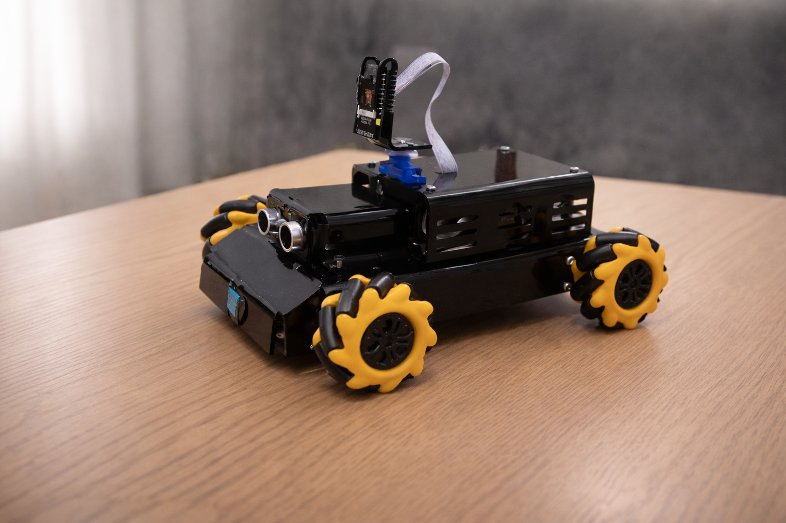
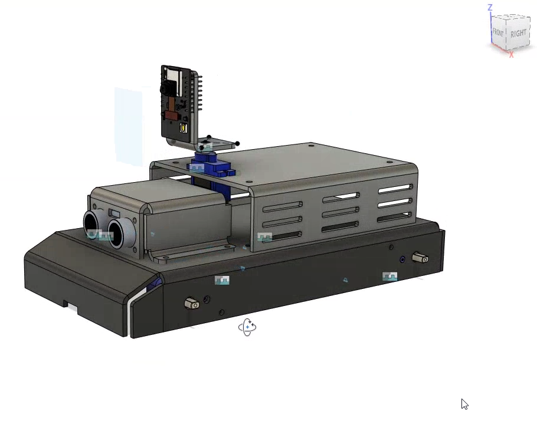
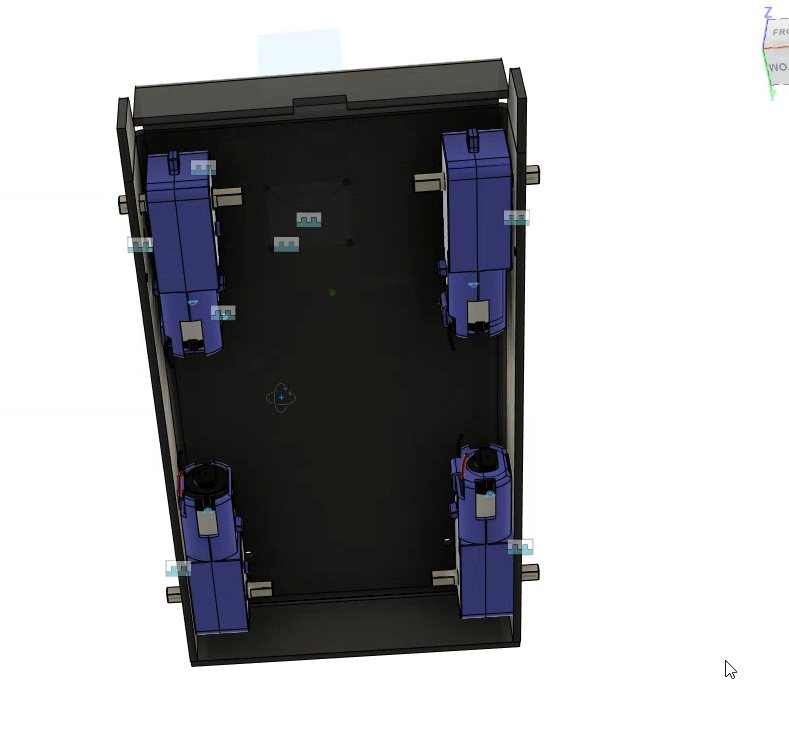
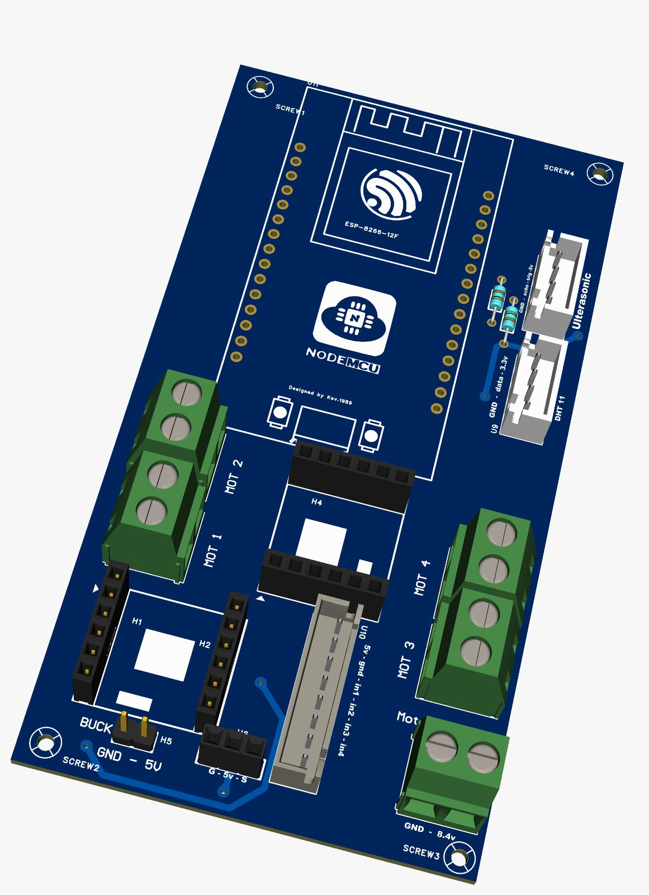
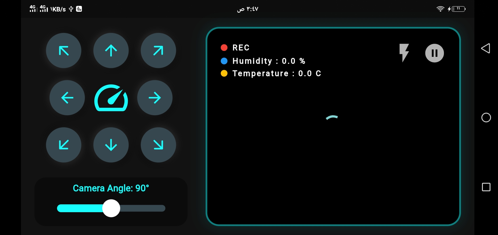

# 🤖 Smart Surveillance & Mecanum Robot

## 📌 Overview
This project is a **smart mobile robot** designed for surveillance, environmental monitoring, and remote control.  
It features **omnidirectional movement** using mecanum wheels, live video streaming, and real-time sensor monitoring.

The robot is fully designed using **Fusion 360 (Sheet Metal)** and physically built using **CNC-cut acrylic**, followed by **thermal bending** for precise shaping.

---

## 🖼️ Hardware Prototype

---

## 🧠 System Architecture

The system is built using a **distributed architecture**:

- **ESP32-CAM**
  - Handles video streaming
  - Controls one side of the motors

- **ESP8266**
  - Handles sensors and servo control
  - Controls the other side of the motors

- Communication between ESPs:
  - ⚡ **ESP-NOW (low latency, peer-to-peer)**

- Communication with mobile app:
  - 🌐 **WiFi + WebSocket**

---

## ⚙️ Mechanical Design

- Designed using **Fusion 360 Sheet Metal**
- Material: **Acrylic (CNC cut)**
- Post-processing:
  - Heat bending for precise angles
- Compact and modular structure

---

## 🔩 Internal Layout

- 4 × TT Motors
- Dual ESP architecture
- Custom PCB for clean wiring
- Optimized component placement for balance

---

## 🔌 Electronics & Components

| Component | Description |
|----------|------------|
| 🎥 ESP32-CAM | Video streaming + camera control |
| 📡 ESP8266 | Sensors + servo + control logic |
| ⚙️ DRV8833 | Motor driver |
| 🔋 4 × 18650 Batteries | Power system |
| 🔻 Buck Converter | Voltage regulation |
| 🌡️ DHT11 | Temperature & humidity |
| 📏 Ultrasonic Sensor | Obstacle avoidance |
| 🎯 Servo Motor | Camera positioning |
| 🛞 Mecanum Wheels | Omnidirectional movement |

---

## 🔋 Power System

- 2 Batteries → Motors  
- 2 Batteries → Buck Converter → ESPs  
- Stable voltage regulation using **Buck Converter**

---

## 🧩 Custom PCB

- Designed using **EasyEDA**
- Goals:
  - Organized wiring
  - Reduced errors
  - Easier maintenance

### 🔌 Connectivity
- JST connectors used for:
  - Sensors
  - ESP modules
- Enables plug-and-play assembly

---

## 🎮 Mobile Application Features

### 🚗 Movement Control
- Full omnidirectional control using mecanum wheels:
  - Forward / Backward
  - Side movement
  - Diagonal movement
  - Rotation

### 🎥 Camera System
- Live video streaming
- Flash ON/OFF control
- Servo-based camera angle control (slider)

### ⚙️ Control Features
- Speed control slider
- Real-time response via WebSocket

### 🌡️ Monitoring System
- Temperature & humidity display (DHT11)
- Smart alerts:
  - High temperature notification
  - High humidity notification

---

## 📡 Communication Protocols

| Type | Technology |
|------|-----------|
| ESP ↔ ESP | ESP-NOW |
| App ↔ Robot | WiFi + WebSocket |

---

## 🚀 Key Features

- ✅ Omnidirectional movement (Mecanum Wheels)
- ✅ Live video streaming
- ✅ Real-time sensor monitoring
- ✅ Dual microcontroller architecture
- ✅ Low-latency communication (ESP-NOW)
- ✅ Custom PCB for scalability
- ✅ Modular & maintainable design

---

## 🛠️ Future Improvements

- SLAM or autonomous navigation
- AI-based object detection
- Battery management system (BMS)
- Mobile app UI/UX enhancements
- OTA firmware updates

---

## 👨‍💻 Author

*Tecno Smart*  
**eng.Eslam Ebrahim** 
Embedded Systems & Flutter Developer  
Specialized in IoT, Robotics, and Real-time Systems

---
